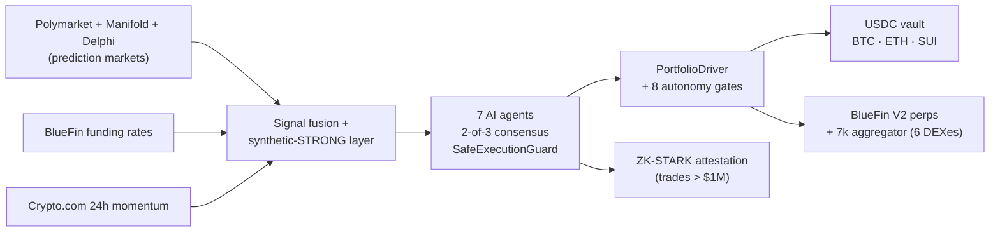

<div align="center">

# ZkWard

**An AI-managed USDC vault on Sui — deposit once, autonomous agents allocate & hedge for you.**

Prediction markets print billions per month in alpha-bearing signal. Riding it consistently needs bots, capital, and 24/7 attention — table stakes for hedge funds, impossible for retail. ZkWard collapses that workflow into a one-click USDC vault: 7 AI agents, BlueFin V2 perp hedging, 3-way reconciliation, 8-gate autonomy defense, ZK-STARK-attested at scale. Live on Sui mainnet.

[](https://suiscan.xyz/mainnet/object/0x107292a69eea2f6eaf4a4e4727ee25d747b04c1985441b138933f0ef33f7b726)
[](#status)
[](https://www.zkward.com)
[](https://www.zkward.com/api/health/production)
[](LICENSE)

[Deposit](https://www.zkward.com) · [Live PnL](https://www.zkward.com/dashboard/overview) · [Risk overview](https://www.zkward.com/dashboard/risk) · [Suiscan proof](https://suiscan.xyz/mainnet/object/0x107292a69eea2f6eaf4a4e4727ee25d747b04c1985441b138933f0ef33f7b726)

</div>

---

> **📍 Canonical repo (as of 2026-09-04).** ZkWard production ships from this repo.

---

**Contents** — [What your USDC does](#what-your-usdc-does) · [Verify in 60s](#verify-in-60-seconds) · [Safety](#safety--the-8-gate-autonomy-defense-system) · [Status](#status) · [Live metrics](#live-metrics) · [Roadmap](#roadmap) · [Built by](#built-by) · [How it works](#how-it-works) · [Revenue](#revenue-model) · [FAQ](#faq) · [Quickstart](#quickstart-contributors) · [Docs](#documentation--disclosure)

## What your USDC does

1. **AI allocates it across BTC / ETH / SUI.** Seven agents fuse Polymarket 5-min binaries, Delphi/Polymarket category markets, Manifold, BlueFin funding rates, and Crypto.com momentum into one directional signal per asset. Rebalances every 30 minutes only when conviction ≥ 65%.
2. **Hedges the downside on BlueFin V2 perps.** Spot leg routed via BlueFin 7k aggregator (Cetus · DeepBook · Turbos · FlowX · Aftermath · BlueFin), directional perp overlay on BlueFin. When AI turns bearish, the perp shorts. When perps are physically unopenable at small NAV, spot cap → 0 for that asset.
3. **Attests decisions on-chain with post-quantum ZK-STARKs.** Python STARK prover (NIST P-521, no trusted setup) is live and unit-tested; configured to attest any trade > $1M. Activation waits on the audit-gated cap lift. On-chain hedge state is reconciled against BlueFin and Postgres every 15 min.

**Fees:** 50 bps annual mgmt + 10% performance. Both charged by the Move contract itself and routed to an MSafe multisig — public, auditable, no operator custody.

## Verify in 60 seconds

```bash
# No clone required — hits live production endpoints
curl -s https://www.zkward.com/api/health/production | jq
curl -s https://www.zkward.com/api/predictions/per-asset | jq

# With clone — canonical "is the pool in profit?" script
bun run scripts/analyze-pool-pnl.ts
bun run scripts/check-hedge-signal-alignment.ts
```

Or inspect the pool object directly on Suiscan:

- Package: [`0x107292a69eea2f6eaf4a4e4727ee25d747b04c1985441b138933f0ef33f7b726`](https://suiscan.xyz/mainnet/object/0x107292a69eea2f6eaf4a4e4727ee25d747b04c1985441b138933f0ef33f7b726)
- USDC pool state: `0xe814e0948e29d9c10b73a0e6fb23c9997ccc373bed223657ab65ff544742fb3a`
- Deployed 2026-06-12 · [deploy record](./docs/DEPLOY_2026-06-12_v0.2.0.md)

## Safety — the 8-gate autonomy defense system

Shipped July 2026 after a real drawdown revealed passive-only defenses. Each gate defends a specific failure mode; the full stack is verified by an integration test that replays the historical scenario and asserts max NAV loss ≤ 15%.

| Gate | Defends against |
|---|---|
| **PortfolioDriver** | Existing spot never unwound when profit-lock fires — corrective actions actively reshape the balance sheet |
| **Fill verifier** | BlueFin "silent-reject" — orders returning orderHash but never landing on the exchange |
| **Hedgeability spot-cap** | At small NAV, perp minQty makes hedging impossible — spot cap for that asset forced to 0 |
| **Symmetric sell trigger** | Rebalance was one-sided (bought on 65% conviction, never sold on 65% opposing) — now symmetric |
| **Stale-hedge detector** | Positions > 7d old with ≥ 2 signal flips force-close on contradiction |
| **Signal-flip drift-close** | On direction flip, both perp and spot legs unwind — not just perps |
| **AI regret weighting** | Position size shrinks after losing streaks, recovers on wins — prevents AI-euphoria buying tops |
| **Alert response loop** | 3 KILL alerts/hr auto-shrinks spot; 24h profit-lock auto-unwinds; phantom hedge rate > 1% halts trader |

Verify: `bun jest test/integration/pool-drawdown-defense.test.ts` (10/10 green).

**Always-on structural guards:** 2-of-3 agent consensus on trades > $100K · 10% peak-NAV drawdown halt · circuit breaker after 3 failures · 3-way reconciliation (Move ↔ BlueFin ↔ Postgres) · OFAC geo-block (KP/IR/SY/CU/RU/BY) · strict NAV-oracle mode (deposits/withdrawals revert when cron oracle > 2h stale).

## Status

Live on Sui mainnet (v0.2.0, deployed 2026-06-12). **Pre-external-audit**, TVL **deliberately capped at $10K by contract**. Cap lifts after external audit closes — the constraint is intentional operational proof, not a TVL claim.

15 internal audit phases completed pre-mainnet. Engine has been running autonomously since June 2026 with continuous on-chain NAV snapshots; every production incident to date has been caught, remediated, and documented in the [deploy record](./docs/DEPLOY_2026-06-12_v0.2.0.md) and [`docs/DEPLOY_RUNBOOK.md`](./docs/DEPLOY_RUNBOOK.md).

## Live metrics

Snapshot pulled from the Aiven Postgres replica against live Sui mainnet state. Rerun `bun run scripts/analyze-pool-pnl.ts` any time.

| Metric | Value |
|---|---|
| Days running since first NAV snapshot | **46+** (from 2026-05-29; live-computed) |
| NAV snapshots recorded | **2,200+** (≈48/day, matches 30-min cron cadence) |
| Hedges executed lifetime | **214** across BTC / ETH / SUI / SOL PERPs |
| Active crons with heartbeats | **13** — see `/api/health/production` |
| Active members | **3** (limited by $10K TVL cap) |
| Lifetime USDC deposits | **~$38** (rerun `scripts/analyze-pool-pnl.ts` for live number) |
| External auditors engaged | Pending (SUI Foundation grant Tranche 1 deliverable) |

Small absolute numbers by design — the $10K cap is enforced by the contract. Operating metrics prove the engine works; audit + cap-lift unlock scale.

## Roadmap

| Quarter | Milestone |
|---|---|
| **Q3 2026** | External audit close · TVL cap ratchet $10K → $100K · Founding-100 points program live |
| **Q4 2026** | TVL cap ratchet to $1M · Institutional tier live (custody attestations via [`rwa_custody_attestor.move`](./contracts/sui/sources/rwa_custody_attestor.move)) · first EVM chain expansion |
| **Q1 2027** | TVL cap ratchet to $10M · Enterprise white-label API · TGE (utility token, governance + fee-share) |

Cap ratchets are contract-gated via `admin_set_tvl_cap` and gated on each milestone's success criteria (audit pass, incident-free operating window, TVL sustained). Not aspirational — each unlock is a specific contract call after a specific evidence bundle.

**Multi-chain posture.** SUI is the lead chain by design and gets new features first. Cronos, Oasis, Hedera, and Sepolia contracts are compiled, tested, and configured in `hardhat.config.cjs`; deployment triggers on institutional demand from that chain, not a race.

## Built by

**Ashish Regmi** ([@HarveReg](https://x.com/HarveReg)) — CS, Cryptography + AI majors. Formerly senior engineer at multiple Fortune 500 companies. Multi-chain hackathon winner across EVM, Aptos, and ICP. Upstream contributor to the [Tether WDK EVM wallet](./patches/PR_wdk-wallet-evm-memzero-fix.md) (accepted PR). Solo builder — open to core contributors and institutional partners.

Contact: `ashishregmi2017@gmail.com` · Telegram [@anstemple](https://t.me/anstemple)

## How it works



## Revenue model

**Live today:** 50 bps annual mgmt + 10% performance fee on vault deposits — charged automatically by `community_pool_usdc.move`, routed to `FeeManagerCap` on MSafe.

**Post-audit (all mapped to shipped code in [`lib/config/pricing.ts`](./lib/config/pricing.ts)):**

- Per-use fees: private hedges ($5 / 25 bps), private portfolios ($100 + 50 bps), custody attestation ($2.5K enrollment + $0.50/submission)
- Subscription tiers: Retail $99 → Pro $499 → Institutional $2,499 → Enterprise
- Per-trade fees on the autonomous perp trader

**Token:** utility-first, designed not launched. Governance over fee parameters, staking gates discounted vault fees. TGE targeted Month 9–12 post-audit.

## Quickstart (contributors)

Node 18+, Bun, Python 3.11+, PostgreSQL.

```bash
git clone https://github.com/ZkVanguard/zkward-ethglobal.git && cd zkward-ethglobal
bun install --legacy-peer-deps

# Terminal 1 — ZK-STARK prover
python -m pip install -r zkp/requirements.txt
python zkp/api/server.py

# Terminal 2 — Next.js
bun run dev

# Pre-commit
bun run typecheck && bun run lint && bun jest
```

Full architecture, env conventions, BlueFin invariants, and reconciliation topology: see [`docs/ARCHITECTURE.md`](./docs/ARCHITECTURE.md), [`docs/DEPLOY_RUNBOOK.md`](./docs/DEPLOY_RUNBOOK.md), and [`docs/SUI_DEPLOYMENT.md`](./docs/SUI_DEPLOYMENT.md).

## FAQ

**How do I deposit and withdraw?**
Connect a Sui wallet at [zkward.com](https://www.zkward.com), approve USDC, deposit. Withdrawals are always open — the Move contract computes your USDC share of NAV (idle pool + admin wallet + BlueFin margin) and pays out atomically. Strict NAV-oracle mode adds a safety: if the cron oracle attestation is > 2h stale, both deposits and withdrawals revert to prevent bad pricing.

**What if the AI is wrong?**
Every trade > $100K needs 2-of-3 agent consensus. The [8-gate autonomy defense](#safety--the-8-gate-autonomy-defense-system) catches most failure modes automatically. Drawdown > 10% from peak NAV auto-halts new hedges. AI regret weighting shrinks position sizes after losing streaks. Beyond that, you can withdraw at any time.

**What if the operator disappears?**
Withdrawals are non-custodial — the Move contract holds pool USDC and computes payouts against the on-chain state. Fees route to a MSafe multisig, not a hot wallet. Off-chain BlueFin margin is the one operational dependency; the `sui-hedge-reconcile` cron sweeps it back to the pool address every hour, and `close_hedge` funds-verify (via AgentCap) prevents drain scenarios.

**Why is TVL capped at $10K?**
Deliberate. The cap is enforced by the Move contract itself (`admin_set_tvl_cap`) and lifts only after external audit closes. Operating publicly at a bounded size is proof — same code, same crons, same defense stack, capital-constrained until reviewers sign off.

**How is this different from Ethena / GMX / Aave GHO?**
Ethena is delta-neutral USDe backed by ETH shorts. GMX is a perp DEX. Aave GHO is over-collateralized. ZkWard is none of these — it's an AI-directional vault that uses **prediction markets as its alpha source** and perps only to hedge, not to yield-farm. Closest analog is a Yearn v3 strategy vault, but with signal-driven allocation instead of yield harvesting.

**What if BlueFin has an outage?**
`bluefin-health` cron runs a 3-strike de-risk (close-all reduceOnly on venue degradation). `bluefin-db-reconcile` (every 15 min) and `sui-hedge-reconcile` (hourly) sweep any orphaned positions when the venue recovers. The vault continues to accept deposits/withdrawals against on-chain NAV throughout.

## Documentation & disclosure

- **[docs/ARCHITECTURE.md](./docs/ARCHITECTURE.md)** — system design overview
- **[docs/DEPLOY_RUNBOOK.md](./docs/DEPLOY_RUNBOOK.md)** — incident response, admin endpoints, env presets, BlueFin invariants
- **[docs/DEPLOY_2026-06-12_v0.2.0.md](./docs/DEPLOY_2026-06-12_v0.2.0.md)** — v0.2.0 mainnet deploy record
- **[docs/ARCHITECTURE.md](./docs/ARCHITECTURE.md)** · **[docs/SUI_DEPLOYMENT.md](./docs/SUI_DEPLOYMENT.md)** · **[docs/MAINNET_READINESS.md](./docs/MAINNET_READINESS.md)**

Responsible disclosure: report security issues privately to `ashishregmi2017@gmail.com`. Do not file public issues for active vulnerabilities.

## Acknowledgments

Built on [Sui](https://sui.io), [BlueFin V2](https://bluefin.io), [Polymarket](https://polymarket.com), [Manifold](https://manifold.markets), [Crypto.com](https://crypto.com), [Aiven](https://aiven.io), [Upstash](https://upstash.com), and [Vercel](https://vercel.com).

## License

[Apache 2.0](./LICENSE)
